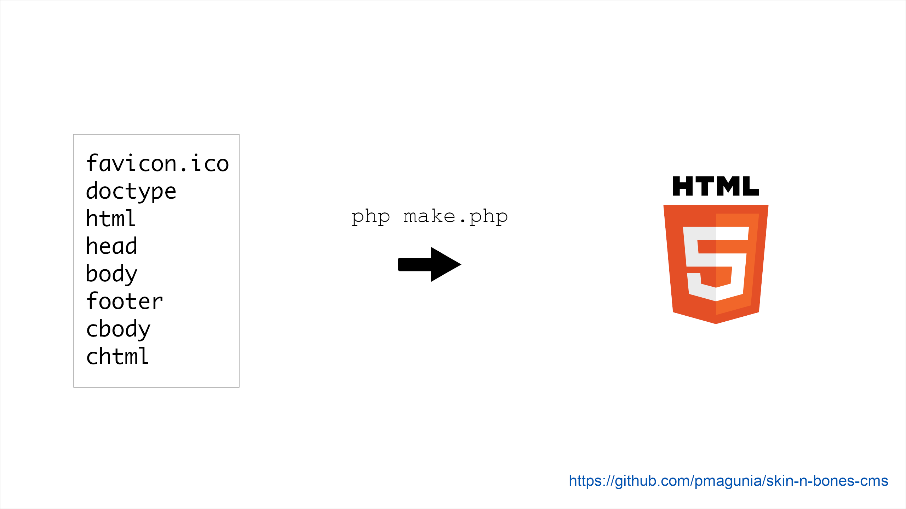

# Skin n' Bones CMS
Skin n' Bones is a free, flexible, and super-lightweight CMS used to build daily journal entries in HTML. While effort has been made to make pages visually appealing using a minimalist style, it is intended to be used purely for text. If you're not familiar with the shell, Skin n' Bones CMS may not be for you. Features include:

* Dark mode support
* Easy override of existing HTML
* Automatic Table of Contents page generation and updates
* Fonts optimized for legibility
* Mobile support
* Book version of journal entries (new)
* Easier to customize (new)

# Prerequisites
* PHP
* Basic HTML knowledge.
* Bash shell skills

You will need [PHP](https://www.php.net) installed on your computer or server to generate the webpages. PHP is a programming language that is commonly used to build websites and web applications. On MacOS, PHP is installed by default. For Linux, open Terminal and type `sudo apt-get install php`. For Windows, you will have to work harder. Some options include installing [Bitnami](https://bitnami.com/stack/wamp/installer) or [XAMPP](https://www.apachefriends.org/index.html). There is also the [Windows Subsystem for Linux](https://docs.microsoft.com/en-us/windows/wsl/install-win10). If you need a quick refresher in HTML, you can see this [basic guide](https://www.w3.org/MarkUp/Guide) by W3C.

# Use

Get started by downloading or cloning this repository. You create journal entries by going to the `src` directory and creating an appropriately named file which contains HTML markup or by using the Bash shell script provided (more on that later). Two example files are provided. Stick to the existing naming scheme for files, namely `yyyy-mm-dd`.

The default sorting for the table of contents is reverse chronological. For chronological order, create a file called `toc_ascending` in the top-level directory. The content of the `toc_ascending` file does not matter - it can be empty. The presense of the file tells the Skin n' Bones CMS to sort in chronological order. If at a later time, you would like to change the sorting, just delete the file and run the make PHP file again as seen below.

Once you've created the webpage source, run these command in Terminal. Running these commands without making any changes to the Skin n' Bones repo will generate two default webpages as seen on the [demo](https://journal.pmagunia.com).

|Command|Description|
|-------|-----------|
|`cd /my/path/to/skin-n-bones-cms`|Navigate to Skin n' Bones CMS directory|
|`./make_today.sh`|Create an entry for today's date|
|`cd src`|All edits should be in this directory|
|`php make.php`|Populate the public_html directory with HTML files|

Be careful in the future when running `make.php` as the `public_html` directory will be wiped out and repopulated with the latest changes when you do this. **You will want to edit all your journal changes in the `src` directory.** A Table of Contents page will be created along with the journal entries which can be seen by visiting `public_html` in your browser. You can then publish this directory to the web or just keep the entries on your local system. Publishing to the web involves uploading files to your web hosting provider. Hosting is usually not free but can be pretty cheap. Some options include Github Pages, AWS Cloudfront/S3, and Blue Host. I personally use [S3_website](https://github.com/laurilehmijoki/s3_website) to upload files though the software is kind of dated. If you need a little help with this CMS, I would be happy to guide you in my spare time.

To add your own Google Analytics tracking code edit the `head` file and replace the default Google JavaScript with your own. You can also change the author metatag and make other customizations. You can override the:

* Doctype - `doctype`
* head - `head`
* favicon.ico - `favicon.ico`
* body - `body`
* footer - `footer`
* Closing body tag - `cbody`
* Closing html tag - `chtml`

To create custom metatags for the title and description of individual journal pages, go to the `src` directory and using an existing HTML filename, create a new `.meta` file that contains the metatag HTML or use the `make_today.sh` shell script as described above. If you're using the shell script and don't want to deal with meta tags delete the `tpl.meta` file. Two examples of meta files have been provided.

Feel free to report bugs and feedback to the issue queue. You can also open support requests if necessary. If there are any corrections or additions to this guide, please let me know.

If you found, the software useful, you can star my repo. Happy Journaling!

# Demo

[Skin n' Bones CMS Demo](https://journal.pmagunia.com)
